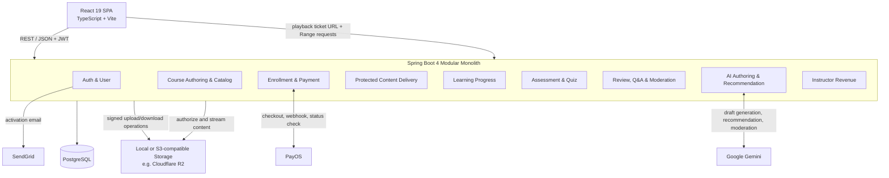
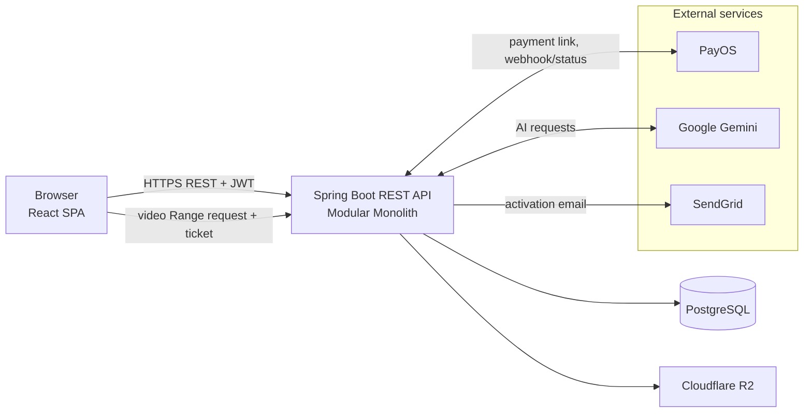

# High-Level Design — Learnova

| | |
|---|---|
| **Project** | Learnova — Online Course Marketplace |
| **Version / Sprint** | 0.2 — Sprint 4 |
| **Last updated** | 13-09-2026 |

**Record of Changes**

| Date | Ver | Sprint | A/M/D | In charge | Change |
|------|-----|--------|-------|-----------|--------|
| 21-08-2026 | 0.1 | 1 | A | | Khởi tạo kiến trúc tổng thể |
| 13-09-2026 | 0.2 | 4 | M | | Cập nhật module, tích hợp và luồng triển khai theo code hiện tại |

---

## 1. Mục đích & phạm vi

Tài liệu mô tả kiến trúc của phiên bản Learnova đang có trong repository: ứng dụng web React giao tiếp với REST API Spring Boot, các module nghiệp vụ, dữ liệu, lưu trữ tệp và dịch vụ ngoài đang được sử dụng.

Phạm vi hiện tại gồm xác thực email/mật khẩu, hồ sơ, quản lý và khám phá khóa học, backward design, quiz, thanh toán PayOS, ghi danh, học tập và theo dõi tiến độ, review/Q&A, kiểm duyệt nội dung, recommendation, AI hỗ trợ soạn course và báo cáo doanh thu.

Không thuộc phạm vi code hiện tại: đăng nhập OAuth, giỏ hàng nhiều khóa học, chứng chỉ, ứng dụng mobile native và giao diện quản trị tổng quát.

---

## 2. Tổng quan kiến trúc

Learnova dùng **modular monolith**: một backend Spring Boot chia theo module nghiệp vụ, truy cập chung PostgreSQL. Frontend là React SPA riêng. Các module trao đổi qua service/repository trong cùng ứng dụng; client gọi backend qua REST/JSON.

Frontend route guards control navigation by authentication and role. Backend Spring Security and ownership/access checks remain the authority for protected operations.

---

## 3. Phân rã module

| Module | Trách nhiệm | Dữ liệu chính | Phạm vi |
|--------|-------------|----------------|---------|
| Auth & User | Đăng ký, kích hoạt email, đăng nhập, refresh/logout, hồ sơ và vai trò | `users`, registration/session data | US-01, US-02, US-04 |
| Course & Catalog | Course CRUD, category, outcomes, sections, lessons, assessments, curriculum and publication | `courses`, `categories`, `learning_outcomes`, `sections`, `lessons`, `assessments`, `quizzes` | US-05..US-07, US-10..US-11, US-23, US-27 |
| Enrollment & Payment | Ghi danh miễn phí, tạo PayOS checkout, xử lý webhook và tra trạng thái | `enrollments`, `payment_orders` | US-14, US-16, US-19 |
| Content Delivery | Kiểm tra quyền, cấp playback ticket/session và phục vụ nội dung có hỗ trợ Range | lesson storage metadata, playback session | US-15, US-16 |
| Tracking | Lưu lịch sử xem/coverage và tính tiến độ course | `lesson_progress`, enrollment progress | US-17, US-19 |
| Assessment & Quiz | Instructor authoring, AI quiz draft, learner attempts, chấm điểm | `assessments`, `quizzes`, `quiz_questions`, `quiz_attempts` | US-07, US-20, US-24 |
| Review, Q&A & Moderation | Review course, hỏi đáp theo lesson, kiểm tra nội dung gửi lên | `course_reviews`, Q&A records | US-18, US-21, US-26 |
| AI Authoring & Recommendation | Sinh quiz/curriculum draft, gợi ý outcome, recommendation | course/quiz domain data, recommendation data | US-22, US-24, US-25 |
| Revenue | Tổng hợp payment đã thanh toán theo instructor/course | `payment_orders` | US-09 |

Các tên bảng mang tính khái quát theo entity và migration hiện tại; schema chi tiết được quản lý trong `ELearningBE/src/main/resources/db/migration/`.

---

## 4. Dữ liệu và tích hợp ngoài

**PostgreSQL:** Backend dùng Spring Data JPA/Hibernate. Schema có các Flyway migrations; cấu hình hiện tại cũng bật Hibernate `ddl-auto=update`. Kết nối, credentials và cấu hình môi trường được lấy từ application properties/environment variables.

**Object storage:** Storage abstraction hỗ trợ local storage khi phát triển và S3-compatible storage khi cấu hình. Video, ảnh và tài liệu được lưu bằng storage key; API cấp quyền upload/download theo cơ chế URL có chữ ký. Luồng playback được kiểm tra quyền bởi backend và nội dung được stream qua endpoint backend, hỗ trợ HTTP Range.

**PayOS:** Backend tạo payment link cho khóa học trả phí, xác minh chữ ký webhook và đồng bộ trạng thái đơn. Enrollment được tạo sau khi xác nhận thanh toán; trang redirect trên trình duyệt không tự xác nhận giao dịch.

**Google Gemini:** Được gọi cho AI authoring, course recommendation và kiểm duyệt nội dung theo cấu hình. Nội dung soạn bằng AI được trả về dạng draft để người dùng xem và áp dụng.

**SendGrid:** Gửi email kích hoạt tài khoản khi đăng ký.

| Hệ thống | Mục đích | Xử lý khi lỗi |
|----------|----------|----------------|
| PayOS | Checkout, webhook và tra trạng thái thanh toán | Giữ trạng thái nội bộ đã xác minh; API tra trạng thái có thể đồng bộ lại từ PayOS |
| Cloudflare R2 | Ảnh, video, tài liệu và nội dung khóa học | Lỗi upload/đọc được trả về cho luồng gọi; nội dung chưa sẵn sàng không được xem là đã upload thành công |
| Google Gemini | AI authoring, recommendation và moderation | Tính năng phụ thuộc cấu hình và phản hồi từ provider; nội dung sinh ra cần được người dùng duyệt |
| SendGrid | Email kích hoạt tài khoản | Tài khoản chờ kích hoạt cho đến khi hoàn tất bước xác nhận |
| PostgreSQL | Dữ liệu nghiệp vụ và trạng thái giao dịch | Các thao tác cần dữ liệu không thể hoàn tất khi DB không khả dụng |

---

## 5. Deployment view

Backend và frontend được build/chạy riêng. Storage provider, database, PayOS, Gemini và email được cấu hình qua biến môi trường; cấu hình production cụ thể phụ thuộc môi trường triển khai.
