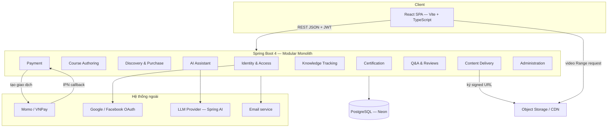
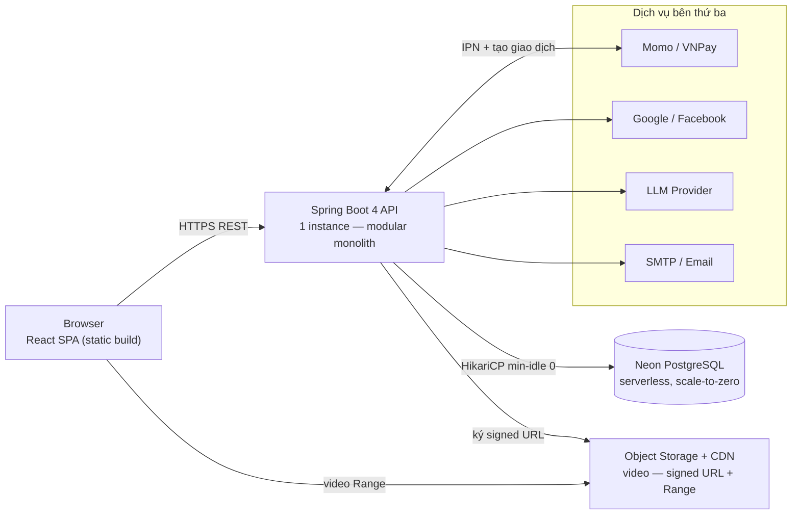

# High-Level Design — Learnova

| | |
|---|---|
| **Project** | Learnova — Online Course Marketplace |
| **Version / Sprint** | 0.1 — Sprint 1 |
| **Last updated** | 21-08-2026 |

**Record of Changes**

| Date | Ver | Sprint | A/M/D | In charge | Change |
|------|-----|--------|-------|-----------|--------|
| | 0.1 | 1 | A | | Khởi tạo HLD: kiến trúc tổng thể, phân rã module, quyết định kiến trúc |

---

## 1. Mục đích & phạm vi

Tài liệu mô tả **kiến trúc tổng thể** của Learnova: kiểu kiến trúc, phân rã module theo bounded context, cách các thành phần và hệ thống ngoài tương tác, cùng các quyết định kiến trúc chính.

---

## 2. Tổng quan kiến trúc

**Kiểu kiến trúc: Modular monolith** — một ứng dụng Spring Boot triển khai duy nhất, chia thành các module theo bounded context, dùng chung một database.

Thành phần runtime: React SPA (frontend) giao tiếp Spring Boot REST API qua JSON + JWT; dữ liệu lưu ở Neon PostgreSQL; video lưu và phân phối qua Object Storage / CDN; tích hợp ngoài gồm Momo/VNPay, Google/Facebook OAuth, LLM Provider (qua Spring AI) và Email.

---

## 3. Phân rã module

| Module | Trách nhiệm | Bảng chính | FR | Sprint |
|--------|-------------|------------|-----|--------|
| Identity & Access | Đăng ký, đăng nhập, OAuth, phân quyền, chọn vai trò | `users` | FR-AUTH-01..03 | 1 |
| Course Authoring | Tạo/sửa course, section, lesson, quiz; publish | `courses`, `categories`, `course_sections`, `lessons`, `quizzes`, `quiz_questions`, `course_status_logs` | FR-CA-01..05 | 1–3 |
| Discovery & Purchase | Tìm kiếm, lọc, trang chi tiết, mua & tạo enrollment | `courses` (đọc), `shopping_cart`, `wishlist`, `enrollments` | FR-CD-01..06 | 2 |
| Payment | Tạo giao dịch Momo/VNPay, xác nhận qua IPN | `payments`, `payment_items` | FR-PAY-01..05 | 2 |
| Content Delivery | Cấp signed URL, chặn truy cập chưa mua, phát video có Range | `lessons` (`storage_key`), `enrollments` | FR-DL-01..05 | 3 |
| Knowledge Tracking | Ghi vị trí xem, watched coverage, % hoàn thành | `lesson_progress`, `enrollments` | FR-KT-01..05 | 3 |
| Assessment (Quiz) | Làm quiz, chấm điểm phía server | `quiz_attempts` | FR-CA-03 | 2–3 |
| Certification | Cấp chứng chỉ khi đạt ngưỡng | `certificates` | FR-KT-05 | 4 |
| Q&A & Reviews | Hỏi đáp, đánh giá khóa học | `qna_posts`, `reviews` | — | 3–4 |
| AI Assistant | Tóm tắt lesson, flashcard, gợi ý course | `lesson_summaries`, `flashcards`, `course_recommendations` | FR-AI-01..03 | 4 |
| Administration | Khóa tài khoản, gỡ course | `users`, `courses` | FR-ADM-01..02 | 4 |

---

## 4. Tầng dữ liệu & tích hợp ngoài

**Database — Neon PostgreSQL (serverless):**  Neon có đặc tính **scale-to-zero**: sau thời gian idle, compute ngủ và các connection cũ trong pool trở thành dead. Cấu hình HikariCP tương ứng: đặt `minimum-idle: 0` và rút ngắn `max-lifetime` để pool không giữ connection chết. Migration dùng **Flyway** (versioned, thư mục `src/main/resources/db/migration/`).

**Object Storage / CDN:** lưu video theo `storage_key` (không phải URL public); phát qua signed URL có thời hạn và HTTP Range. Cần chọn provider hỗ trợ signed URL + Range (S3-compatible: AWS S3/CloudFront, Cloudflare R2, MinIO…) — **quyết định chưa chốt**.

**Payment (Momo/VNPay):** xác nhận qua IPN server-to-server (NFR-08); không tin redirect client (FR-PAY-05).

**OAuth (Google/Facebook):** Authorization Code flow, đổi code lấy token phía server — chi tiết LLD Flow 1.

**LLM Provider (Spring AI):** phục vụ tóm tắt, flashcard, gợi ý. Lỗi AI **không** được chặn luồng học hay thanh toán (NFR-09).

**Email:** xác thực tài khoản, gửi chứng chỉ; lỗi đưa vào queue/retry, không chặn luồng chính (NFR-09).

| # | Hệ thống ngoài | Mục đích | Khi lỗi |
|---|----------------|----------|---------|
| 1 | Momo / VNPay | Thu tiền, xác nhận qua IPN | Timeout → Order `EXPIRED` (FR-PAY-04); chữ ký sai → từ chối + log (FR-PAY-02) |
| 2 | Object Storage / CDN | Lưu & phân phối video | Client retry, hiển thị lỗi phát |
| 3 | LLM Provider (Spring AI) | Tóm tắt, gợi ý | Bỏ qua, không chặn luồng học (NFR-09) |
| 4 | Email service | Xác thực, chứng chỉ | Queue + retry |
| 5 | Google / Facebook | Đăng nhập OAuth | Báo lỗi, cho đăng nhập bằng email/mật khẩu |

---

## 5. Deployment view

---
