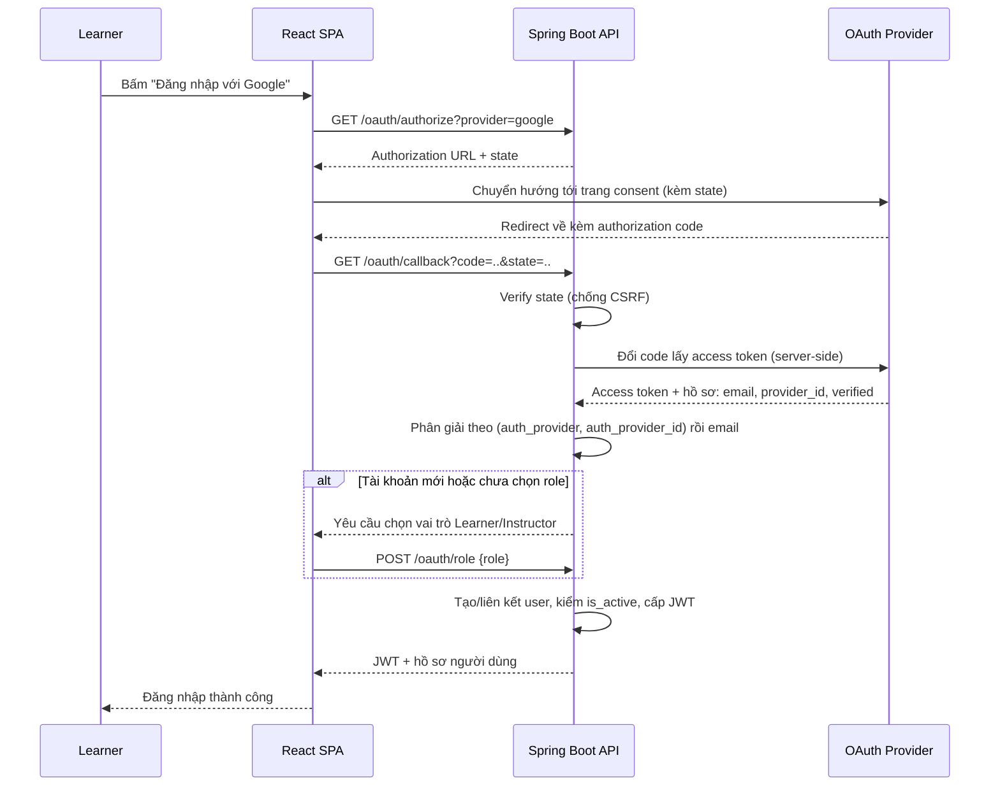
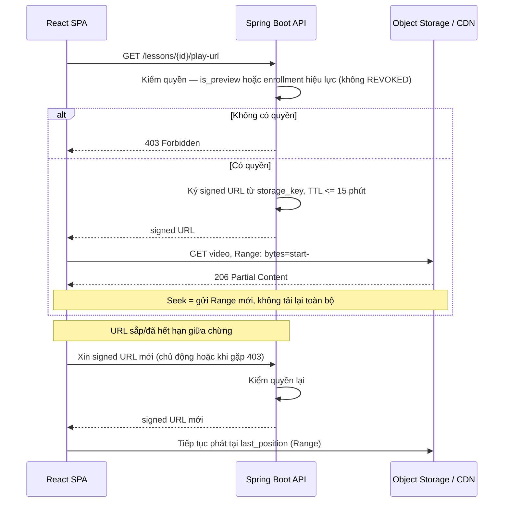
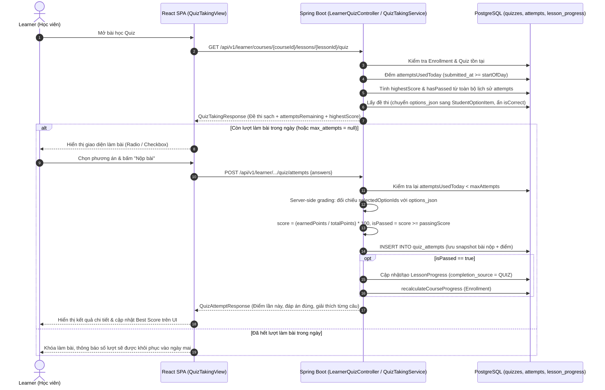

# Low-Level Design — Learnova

| | |
|---|---|
| **Project** | Learnova — Online Course Marketplace |
| **Version / Sprint** | 0.1 — Sprint 1 |
| **Last updated** | 20-08-2026 |

**Record of Changes**

| Date | Ver | Sprint | A/M/D | In charge | Change |
|------|-----|--------|-------|-----------|--------|
| | 0.1 | 1 | A | | Khởi tạo LLD: OAuth login + thiết kế trước 2 hard core |

---

## Mục đích & phạm vi

LLD đặc tả chi tiết các **luồng có rủi ro kỹ thuật cao hoặc tích hợp bên thứ ba**. Tài liệu này gồm:

- **Flow 1 — OAuth Login (Sprint 2):** .
- **Flow 2 — Protected Video Delivery (Sprint 3):** hard core #1.
- **Flow 3 — Knowledge Tracking (Sprint 3):** hard core #2.
- **Flow 4 — Learner Quiz Taking & Daily Attempt Window (Sprint 3):** US-20.

---

## Flow 1 — OAuth Login (Google / Facebook)

### Edge case & lỗi

- `state` không khớp → từ chối (nghi CSRF).
- Provider không trả email hoặc email chưa verified → **không** tự liên kết; yêu cầu xác thực thêm.
- Tài khoản bị Admin khóa (`is_active = false`, BR-21) → chặn đăng nhập kể cả qua OAuth.

---

## Flow 2 — Protected Video Delivery (signed URL + HTTP Range)

### Luồng cấp phát & phát video
`lessons.storage_key` chỉ trỏ tới object trong Object Storage — **không lưu URL public** (BR-12). URL chỉ được **ký tại thời điểm có request hợp lệ**, với thời hạn ngắn.

---

## Flow 3 — Knowledge Tracking (watched coverage bằng bitmap)

Làm trong sprint 2

---

## Flow 4 — Learner Quiz Taking & Daily Attempt Window (US-20)

### 1. Mục đích & Nguyên lý
Phục vụ học viên làm bài trắc nghiệm gắn với bài học (`Lesson.contentType = 'QUIZ'`). Hệ thống thực hiện:
- **Bảo mật đề thi (BR-16)**: Ẩn hoàn toàn cờ `isCorrect` và `explanation` khi cấp đề cho học viên.
- **Chấm điểm tự động tại Server**: Hỗ trợ câu hỏi đơn lựa chọn (`SINGLE_CHOICE`) và đa lựa chọn (`MULTIPLE_CHOICE`).
- **Gác số lần làm bài theo ngày (Daily Attempt Window)**: Tận dụng mốc thời gian `submitted_at >= startOfDay` để giới hạn số lần làm bài trong 1 ngày theo `quizzes.max_attempts`. Tự động khôi phục số lượt làm bài về ban đầu vào 00:00:00 ngày mới mà không cần cronjob.
- **Bảo toàn điểm cao nhất (Best Score Preservation)**: Học viên đã Pass vẫn có thể làm lại nhiều lần để ôn tập kiến thức. Hệ thống chọn lần có điểm số cao nhất (`highestScore = max(score)`) làm đại diện và không bao giờ hạ trạng thái Đạt của học viên.
- **Ghi nhận tiến độ khóa học (BR-29 & US-17)**: Khi `isPassed == true`, tạo/cập nhật `LessonProgress` với `completion_source = QUIZ` và tính lại `% hoàn thành khóa học`.

### 2. Sơ đồ tuần tự (Sequence Diagram)

### 3. Edge Cases & Xử lý ngoại lệ
- Học viên chưa đăng ký khóa học (`Enrollment` không tồn tại) → ném lỗi `ENROLLMENT_NOT_FOUND` (404).
- Học viên cố tình gửi request nộp bài khi đã hết lượt trong ngày → ném lỗi `QUIZ_MAX_ATTEMPTS_REACHED` (400).
- Học viên nộp bài làm lại đạt điểm thấp hơn lần thi Đạt trước đó → điểm lần này vẫn ghi nhận, nhưng `LessonProgress` và `highestScore` được giữ nguyên vẹn ở mốc tốt nhất.

