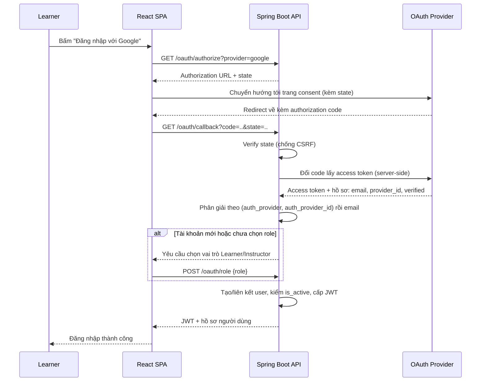
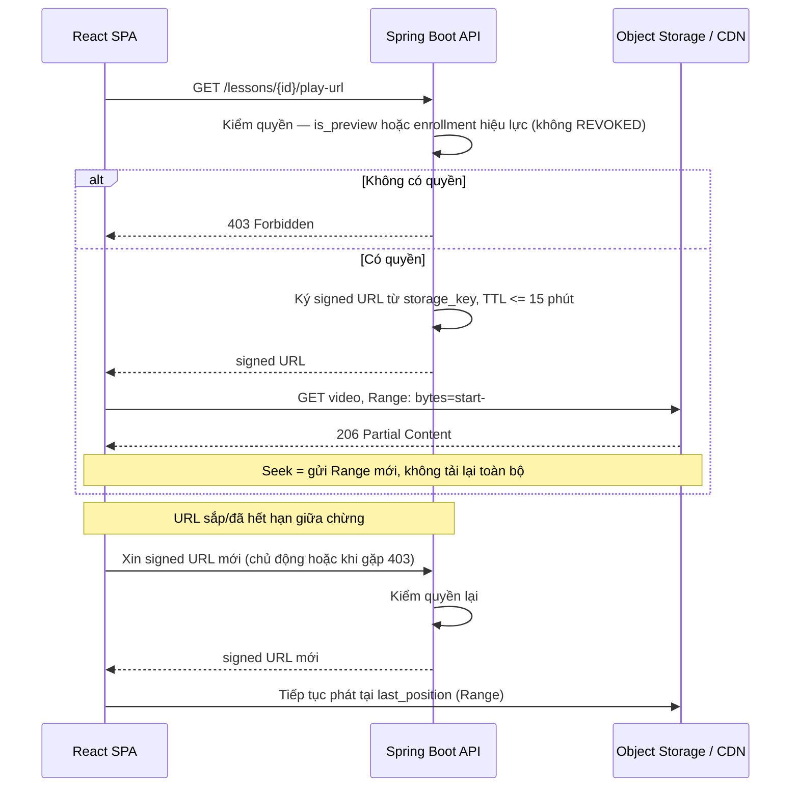

# Low-Level Design — Learnova

| | |
|---|---|
| **Project** | Learnova — Online Course Marketplace |
| **Version / Sprint** | 0.1 — Sprint 1 |
| **Last updated** | 20-08-2026 |

**Record of Changes**

| Date | Ver | Sprint | A/M/D | In charge | Change |
|------|-----|--------|-------|-----------|--------|
| | 0.1 | 1 | A | | Khởi tạo LLD: OAuth login + thiết kế trước 2 hard core |

---

## Mục đích & phạm vi

LLD đặc tả chi tiết các **luồng có rủi ro kỹ thuật cao hoặc tích hợp bên thứ ba**. Tài liệu này gồm:

- **Flow 1 — OAuth Login (Sprint 2):** .
- **Flow 2 — Protected Video Delivery (Sprint 3):** hard core #1.
- **Flow 3 — Knowledge Tracking (Sprint 3):** hard core #2.

---

## Flow 1 — OAuth Login (Google / Facebook)

### Edge case & lỗi

- `state` không khớp → từ chối (nghi CSRF).
- Provider không trả email hoặc email chưa verified → **không** tự liên kết; yêu cầu xác thực thêm.
- Tài khoản bị Admin khóa (`is_active = false`, BR-21) → chặn đăng nhập kể cả qua OAuth.

---

## Flow 2 — Protected Video Delivery (signed URL + HTTP Range)

### Luồng cấp phát & phát video
`lessons.storage_key` chỉ trỏ tới object trong Object Storage — **không lưu URL public** (BR-12). URL chỉ được **ký tại thời điểm có request hợp lệ**, với thời hạn ngắn.

---

## Flow 3 — Knowledge Tracking (watched coverage bằng bitmap)

Làm trong sprint 2
