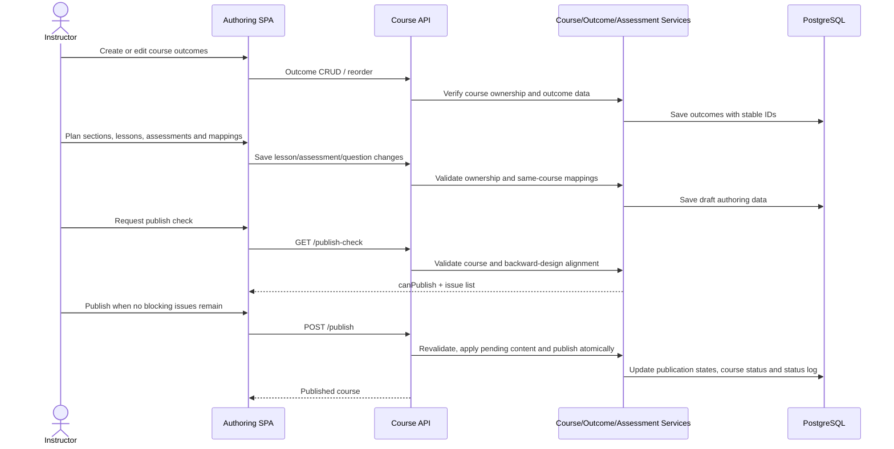
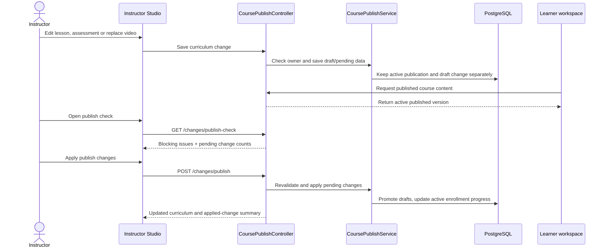
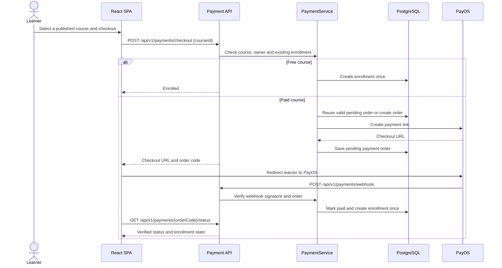

# Low-Level Design — Learnova

| | |
|---|---|
| **Project** | Learnova — Online Course Marketplace |
| **Version / Sprint** | 0.2 — Sprint 4 |
| **Last updated** | 14-09-2026 |

**Record of Changes**

| Date | Ver | Sprint | A/M/D | In charge | Change |
|------|-----|--------|-------|-----------|--------|
| 20-08-2026 | 0.1 | 1 | A | | Khởi tạo LLD cho các luồng kỹ thuật chính |
| 13-09-2026 | 0.2 | 4 | M | | Thay luồng OAuth bằng luồng đang có; bổ sung payment, backward design, AI, publish changes và moderation |

---

## Mục đích & phạm vi

LLD mô tả các luồng triển khai có nhiều kiểm tra quyền, trạng thái hoặc tích hợp ngoài. Backend dùng controller → service → repository/entity; frontend gọi REST API qua các feature API. Các API quản lý course yêu cầu xác thực và kiểm tra quyền sở hữu ở backend.

Các luồng gồm: xác thực email, backward design/course authoring, publish changes, PayOS checkout, AI authoring, playback/progress, quiz attempt và moderation review/Q&A. Không có luồng OAuth trong code hiện tại.

---

## Flow 1 — Course authoring & backward design (US-23)

The authoring model separates course outcomes, lesson plans/content, and assessments. Stable outcome IDs are used by lesson and question mappings; an assessment belongs to a course/section and contains the quiz questions used by learner attempts.

Publish validation checks course metadata, required outcomes and curriculum readiness. Each outcome must have lesson support and be measured by valid quiz questions; assessments must be placed in the course structure before publication. Incomplete draft courses may be saved without passing publish validation.

---

## Flow 2 — Changes to an already published course (US-27)

Changes to a published curriculum are staged as draft content. Replacing a published video stores pending file metadata separately so the active content remains available to learners until the instructor applies the changes.

The publish operation is owner-only and reuses course validation. Course status transitions are recorded in `course_status_logs`; curriculum changes are applied only after explicit instructor action.

---

## Flow 3 — PayOS checkout & enrollment

Frontend return/cancel URLs only navigate back to Learnova. Backend trusts a verified PayOS webhook or a backend status query; duplicate webhook/status processing must not create duplicate enrollments. A recent pending order can be reused; stale pending orders are cancelled before a replacement checkout is created.

---

## Error handling & security notes

- Backend validates authentication, role, course ownership, enrollment, payment signatures and storage access; client-side route guards are not security boundaries.
- External service credentials are configuration values and must be supplied outside source control.
- Payment status changes and enrollment creation are idempotent at the course/learner level.
- Validation errors are returned through the shared API response/error handling; storage, database and provider errors do not produce a successful domain operation.
