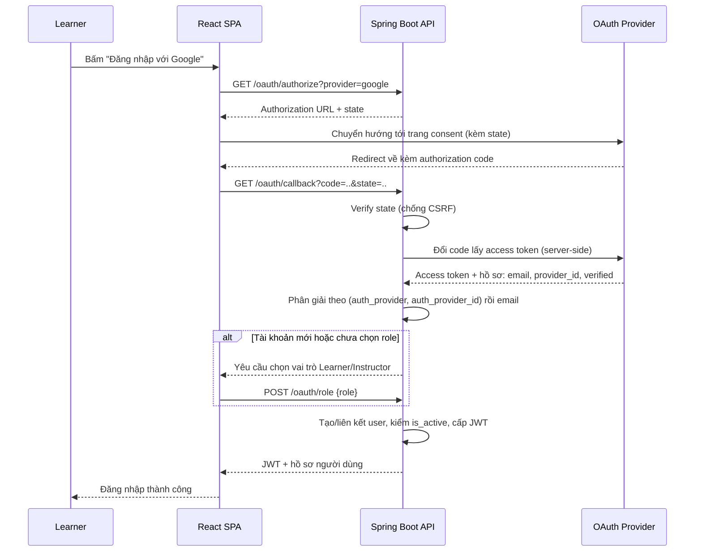
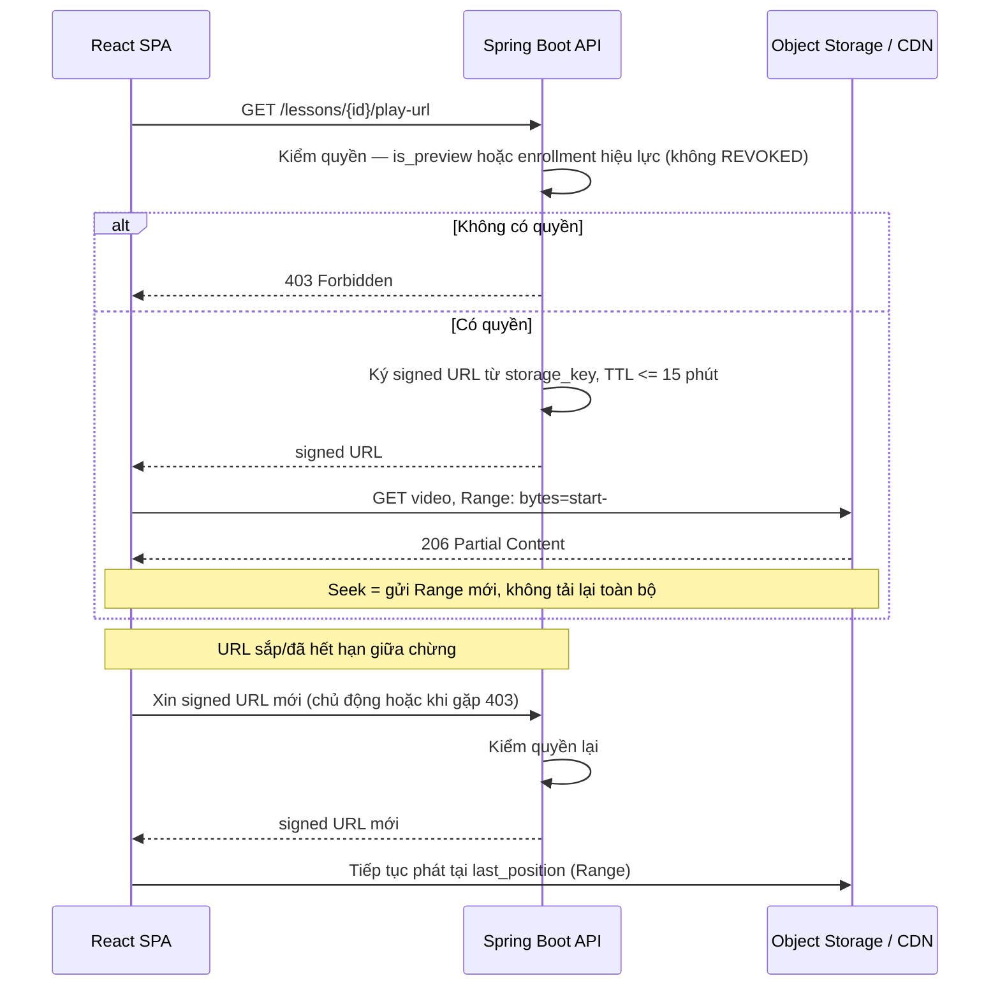
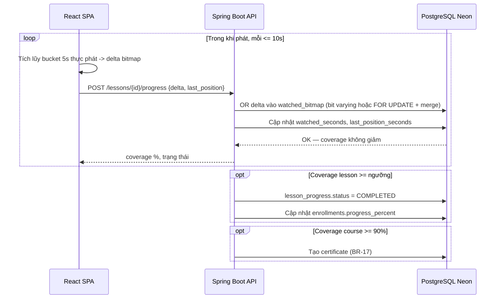

# Low-Level Design — Learnova

| | |
|---|---|
| **Project** | Learnova — Online Course Marketplace |
| **Version / Sprint** | 0.1 — Sprint 1 |
| **Last updated** | 20-08-2026 |


**Record of Changes**

| Date | Ver | Sprint | A/M/D | In charge | Change |
|------|-----|--------|-------|-----------|--------|
| | 0.1 | 1 | A | | Khởi tạo LLD: OAuth login + thiết kế trước 2 hard core |


---

## Mục đích & phạm vi

LLD đặc tả chi tiết các **luồng có rủi ro kỹ thuật cao hoặc tích hợp bên thứ ba**. Tài liệu này gồm:

- **Flow 1 — OAuth Login (Sprint 1):** đang triển khai trong sprint hiện tại.
- **Flow 2 — Protected Video Delivery (Sprint 3):** hard core #1, thiết kế trước để giảm rủi ro.
- **Flow 3 — Knowledge Tracking (Sprint 3):** hard core #2, thiết kế trước.

Luồng **Payment IPN** (Sprint 2) — cũng là luồng bên thứ ba phức tạp — sẽ đặc tả trong LLD của Sprint 2.

> **Ghi chú truy vết:** đăng nhập Google/Facebook nằm trong scope SRS §1.1 và schema (`users.auth_provider`, `auth_provider_id`) nhưng chưa có FR row riêng. Đề xuất bổ sung **FR-AUTH-04** để traceability đầy đủ.

---

## Flow 1 — OAuth Login (Google / Facebook)

**Liên quan:** SRS §1.1, FR-AUTH-02, FR-AUTH-03, BR-03; NFR-05, NFR-07.
**Bảng:** `users` (`auth_provider`, `auth_provider_id`, `email`, `password_hash`, `role`, `is_active`).

### Cách tiếp cận

Dùng **OAuth 2.0 Authorization Code flow**: client chỉ nhận `authorization code`, việc đổi code lấy access token thực hiện **phía server** (không dùng Implicit flow để token không lộ ở client). Tham số `state` chống CSRF.

**Phân giải tài khoản** (sau khi lấy được hồ sơ từ provider):

1. Tìm theo cặp (`auth_provider`, `auth_provider_id`) → nếu có, đăng nhập ngay.
2. Nếu chưa có, tra theo `email`:
   - **Email đã tồn tại** (tài khoản email/mật khẩu hoặc provider khác): chỉ **liên kết** khi email do provider trả về đã được xác thực (verified) — gán `auth_provider_id` vào tài khoản hiện có. Nếu không xác thực được → từ chối, hướng dẫn đăng nhập bằng phương thức gốc (tránh chiếm tài khoản).
   - **Email chưa tồn tại**: tạo `user` mới, `password_hash = NULL` (chỉ đăng nhập qua provider), `is_active = true`.
3. **Gán vai trò (BR-03):** mỗi tài khoản chỉ một vai trò. Nếu là lần đầu và chưa có `role` → yêu cầu chọn Learner/Instructor **trước khi** cấp phiên.

Cấp phiên bằng **JWT bearer** sau khi phân giải xong.



### Quyết định thiết kế

| Quyết định | Lựa chọn | Lý do |
|------------|----------|-------|
| Kiểu flow | Authorization Code (đổi token server-side) | Không lộ token ở client; chuẩn cho web app |
| Khóa phân giải tài khoản | (`auth_provider`, `auth_provider_id`) là chính, `email` là phụ | Tránh tạo trùng account; ổn định kể cả khi user đổi email |
| Xử lý trùng email | Chỉ liên kết nếu email provider đã verified | Chống chiếm tài khoản qua email chưa xác thực |
| Vai trò | Chọn một lần khi đăng ký/đăng nhập đầu (BR-03) | Ràng buộc một vai trò/tài khoản |
| Phiên | JWT stateless | Hợp SPA; kiểm quyền phía server mọi request (NFR-07) |

### Edge case & lỗi

- `state` không khớp → từ chối (nghi CSRF).
- Provider không trả email hoặc email chưa verified → **không** tự liên kết; yêu cầu xác thực thêm.
- Tài khoản bị Admin khóa (`is_active = false`, BR-21) → chặn đăng nhập kể cả qua OAuth.

> Đăng nhập email/mật khẩu chịu ràng buộc khóa tạm thời BR-02 (sai 5 lần/15 phút → khóa 30 phút) — nằm ngoài phạm vi flow OAuth này.

---

## Flow 2 — Protected Video Delivery (signed URL + HTTP Range)

**Liên quan:** FR-DL-01..04, BR-11, BR-12, BR-13, BR-14; NFR-06, NFR-02, NFR-04.
**Bảng:** `lessons` (`storage_key`, `is_preview`, `duration_seconds`), `enrollments` (`status`).

### Nguyên tắc

`lessons.storage_key` chỉ trỏ tới object trong Object Storage — **không lưu URL public** (BR-12). URL chỉ được **ký tại thời điểm có request hợp lệ**, với thời hạn ngắn.

### Luồng cấp phát & phát video

1. Client yêu cầu phát lesson `X`.
2. Backend kiểm tra quyền:
   - `is_preview = true` → cho phép, không cần enroll (BR-14).
   - Ngược lại: learner phải có `enrollment` còn hiệu lực (**không** ở trạng thái `REVOKED`) cho đúng course chứa lesson `X` (BR-11). Sai → **403** (FR-DL-01).
3. Backend ký **signed URL** ngắn hạn (TTL ≤ 15 phút, NFR-06) từ `storage_key`, trả về client.
4. Client phát video **trực tiếp từ Storage/CDN**, gửi `Range` header; Storage/CDN trả **206 Partial Content** → tua tới vị trí bất kỳ mà không tải lại toàn bộ file (FR-DL-03).
5. **Gia hạn giữa chừng (FR-DL-04, BR-13):** signed URL có thể hết hạn khi đang xem. Chiến lược kép: client **chủ động** xin URL mới trước khi TTL hết; đồng thời nếu gặp **403** từ Storage thì gọi lại backend xin URL mới rồi tiếp tục tại `last_position` — player không dừng, không mất vị trí.

**Ai phục vụ Range:** ưu tiên để **Storage/CDN phục vụ trực tiếp** (backend chỉ ký URL, không proxy stream) — offload backend, đáp ứng NFR-02 (<3s bắt đầu phát) và NFR-04 (≥100 concurrent).



### Quyết định thiết kế

| Quyết định | Lý do |
|------------|-------|
| Ký URL lúc request, không lưu URL | Bảo toàn hard core FR-DL-02 / BR-12 |
| TTL ngắn ≤ 15 phút | Thu hẹp cửa sổ chia sẻ lại (NFR-06) |
| Range do CDN/Storage phục vụ | Offload backend, scale video (NFR-02/04) |
| Gia hạn: chủ động + phản ứng-khi-403 | Không gián đoạn phiên xem (FR-DL-04) |
| Kiểm enrollment mỗi lần ký URL | Thu hồi quyền (`REVOKED`) có hiệu lực gần như tức thì |

---

## Flow 3 — Knowledge Tracking (watched coverage bằng bitmap)

**Liên quan:** FR-KT-01..05, BR-15, BR-16, BR-17; NFR-03.
**Bảng:** `lesson_progress` (`last_position_seconds`, `watched_bitmap` `bytea`, `watched_seconds`, `status`, `completed_at`), `enrollments` (`progress_percent`), `certificates`.

### Mô hình bitmap

- Chia mỗi lesson thành **bucket 5 giây**; số bit = `ceil(duration_seconds / 5)`. Chọn 5s để khớp dung sai resume ±5s (FR-KT-01) và cân bằng độ mịn với dung lượng lưu trữ.
- Mỗi bit = 1 nếu bucket đó **thực sự đã được phát**.
- `watched_seconds` = (số bit bật) × 5. Tiến độ lesson = `watched_seconds / duration_seconds`.

### Ghi nhận từ client

- Trong lúc phát, client tích lũy các bucket vừa xem; định kỳ (**≤ 1 request / 10s / learner**, NFR-03) gửi lên backend một **delta bitmap** (các bucket mới xem kể từ lần gửi trước) kèm `last_position_seconds` hiện tại.
- **Chỉ** bucket ứng với phần thực sự phát mới nằm trong delta. Tua/seek chỉ cập nhật `last_position_seconds`, **không** bật các bucket bị nhảy qua → tua tới cuối **không** làm tăng coverage (BR-15, FR-KT-02).

### Hợp nhất phía server — chống lost update (BR-16, FR-KT-03)

Yêu cầu: coverage sau cập nhật **không bao giờ nhỏ hơn** trước đó; cập nhật đồng thời từ nhiều tab/thiết bị không mất dữ liệu. Phép hợp nhất là **OR theo bit** giữa bitmap đang lưu và delta.

Vấn đề kỹ thuật: PostgreSQL **không có toán tử OR trực tiếp trên `bytea`**. Hai lựa chọn:

- **(Khuyến nghị) đổi kiểu cột sang `bit varying`** → OR nguyên tử trong một câu lệnh:
  ```sql
  UPDATE lesson_progress
  SET watched_bitmap = watched_bitmap | :delta,   -- hai toán hạng cùng độ dài = số bit của lesson
      last_position_seconds = :pos,
      updated_at = now()
  WHERE id = :id;
  ```
- **Giữ `bytea`** → hợp nhất ở tầng service dưới khóa dòng: `SELECT ... FOR UPDATE` → OR bằng `BitSet` trong Java → `UPDATE`. Khóa dòng đảm bảo không lost update.

Cả hai cách đều giữ bất biến "coverage đơn điệu tăng" vì OR chỉ thêm bit, không xóa. Tính lại `watched_seconds` sau khi OR: PostgreSQL 14+ có `bit_count()` (Neon hỗ trợ) → `watched_seconds = bit_count(watched_bitmap) * 5`, hoặc tính trong application.

### Hoàn thành & chứng chỉ

- Lesson `COMPLETED` khi coverage lesson ≥ ngưỡng → cập nhật `lesson_progress.status`, `completed_at`.
- `enrollments.progress_percent` = tổng hợp coverage các lesson trong course.
- Chứng chỉ cấp khi **coverage toàn course ≥ 90%** (BR-17, FR-KT-05) → tạo bản ghi `certificates`.



### Quyết định thiết kế

| Quyết định | Lý do |
|------------|-------|
| Bitmap 1 bit / 5 giây | Đủ mịn cho chống tua nhanh, nhẹ về lưu trữ |
| Hợp nhất bằng OR | Idempotent; coverage đơn điệu tăng (BR-16) |
| Nguyên tử: `bit varying` OR hoặc `FOR UPDATE` | Chống lost update đa phiên (FR-KT-03) |
| Chỉ bucket thực phát mới bật bit | Vô hiệu hóa tua nhanh gian lận (FR-KT-02, BR-15) |
| Throttle ≤ 1 request / 10s | Giảm tải ghi (NFR-03) |

> **Điểm cần nhóm quyết định:** cột `watched_bitmap` hiện là `bytea`. Nếu muốn OR nguyên tử trong một câu lệnh SQL, nên đổi sang `bit varying`. Nếu giữ `bytea`, bắt buộc hợp nhất dưới `SELECT ... FOR UPDATE` ở tầng service.
